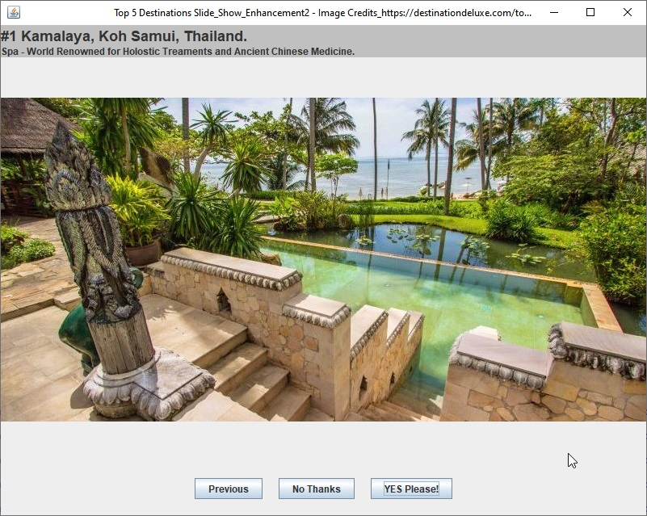
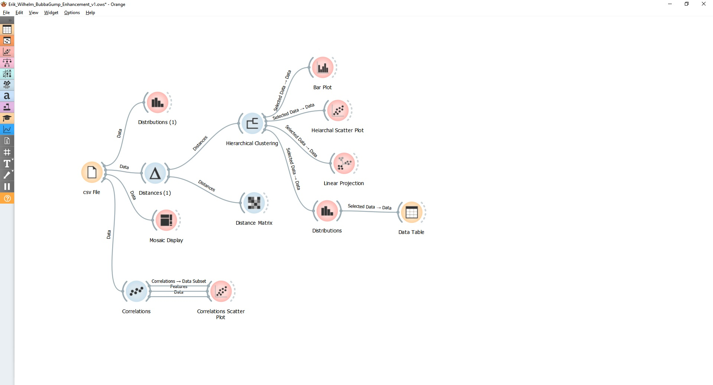

# **Erik-W775.github.io**

---

## CS499 E-Portfolio

---
### Self-Assessment

My time at SNHU in the Computer Science program has helped me develop several skills that have been useful in my existing career and will make me an asset well into my career.  The core classes and electives that I have selected and completed have provided me with skills in troubleshooting, problem solving, developing solutions to complex problems individually and when working with a team. I have experienced Object Oriented Design and Development that centered on providing documentation that ensures all parts of the team from development to stakeholders understand what is required and what is being delivered.  I have worked on team projects that involved using Agile development and management methodologies. I have worked using GitHub to share work with others and using bitbucket for developing software within a team that requires multiple parties to build branches and commit work to a single project. 

I have developed and built upon projects using Python, Java, C, and C++ programming languages to meet project goals and design requirements. I have worked with databases using MySQL and MongoDB and I have worked to evaluate and understand data and databases using data mining software JMP and open-source Orange Data Mining software. Through peer review and incremental development, I have worked with arrays, binary search trees, linked lists, and for secure login and credential storage I have worked with hash tables for encryption. Through course discussion boards and project reviews I have learned to collaborate with diverse audiences and improvement through self-reflection. 

I chose artifacts for my portfolio that showcase how I have worked to develop a well-rounded approach to providing efficient and well documented solutions to technological and everyday problems. Using a scientific approach to the ever-growing world of Computer Science and the lives it effects, I have built skills that will serve to provide solutions where others might not. The artifacts that I chose have been developed in languages and environments that were unknown to me when starting and by using algorithmic and scientific thinking I have been able to learn and succeed in these areas. The first artifact I chose to include is my course project from CS-330 Computer Graphic Visualization to showcase my ability to work using C and C++ within one of the most popular IDE’s currently Visual Studio. In this environment I developed a world made of objects of my choosing that allows a user to navigate the world in all directions to provide a computer generated “world” view. I worked to understand matrices and how the software manipulates them to created the geometry to be rendered. I have shown my understanding of data structures and how they work to support and enhance program efficiency using libraries and search structures for sharing and storing data.   The second artifact is from CS-250 Software Development Lifecycle. This was my course project that was developed using Java programming and working in Eclipse IDE for Java. I developed code that when compiled would create a GUI window that would act as a slide show for vacation destinations with descriptions. I added a button feature that allows for including external links by opening up the system browser and navigating to a specified webpage. I chose to open the native browser for user security and to ensure that it would operate for multiple audiences.  The third artifact that I am including is from DAT-220 Introduction to Data Mining. The course project required JMP enterprise software that was provided by the university. Using the methods that I learned in the course I chose to use Open-Source data mining Software by Orange (https://orangedatamining.com) to evaluate the data while learning a new software. Using information that I was familiar with and software that was new, I was able to find evidence to support my original findings and evidence that my original data had more inaccuracies than I originally anticipated. I created a project file that is native to Orange that can be used by any audience to verify my findings and collaborate on changes. I have included a video that provides background to my findings and acts as an introduction to my process, and have updated my original report to show new findings.

I have learned throughout my studies that the best way to support your work and increase security of information it is important to point out possible inaccuracies and areas of improvement. After completing my program, I plan to use many of the methods and processes I have learned to further my career and learning. I will become more familiar with Java development and build on that knowledge with C++ as these are the two languages, I have the most difficulty with and interest in. I plan to develop my network design and Information Security skills to become a PEN tester. I will need to continue working with teams to develop my skills and learn from diverse audiences. 

---

[Watch Code Review Here](https://app.screencast.com/GMRMEBDedVJtw)

---

### ***Artifact 1 Enhancement*** 

The artifact that I selected for this enhancement was my final project for CS-330 Computer Graphics and Visualization in early 2021. The set up for the project was to select several objects with at least 1 that was comprised of multiple objects and render them using C++ and OpenGL.

---
***Enhancement Outcome***

Enhancements: Software and IDE update, Image creation and modifications, template creation, “World” view keyboard navigation, and added code.

Outcomes: Better image creation, updates to colors, textures, showing lighting reflection, modularity using templates and block coding, added readability using commenting and removing unused code and variables, increased code security using testing throughout code, updating software, and removing unused code and comments.

Course Outcomes found in Enhancement 1: In this artifact enhancement, I employed strategies for building collaborative environments for a diverse audience by adding inline comments as well as header information. I created a video that showed the existing code and how I intended to enhance it. I designed, developed, and delivered a project that was accompanied by professional quality assessment and video code review that clearly stated my goals and intentions and outcomes. I used software design and engineering mindset to solve the problem of code not compiling initially and to add additional navigation for the world view. I demonstrated that I can and have used well founded and innovative skills by creating a template and ensuring that the code is modular and usable by many different audiences. I demonstrated that I have a security mindset by performing an initial code review, removing unused variables and calculations and applied inline commenting and notes for reference. I was able to add to the codes usage by creating a template file that will help start projects in the future and that includes many shape and shader files as well as proper pathing for libraries. This will speed up initial project startup and aid in creation of other library files as needed. The code is more secure because I updated my development and operating system software prior to starting the new project and now it is operating in the most up to date versions. I created secure code that can be communicated and resourced by ensuring that it was clearly commented, free of unused calculations and variables, and I tested the code incrementally as I developed it. 
   
[Link to Enhancement_1 Project](https://github.com/Erik-W775/Erik-W775.github.io/tree/main/Enhancement_1)

---

---

### ***Artifact 2 Enhancement*** 

The artifact that I selected for this enhancement is from CS-250 Software Development Lifecycle that I took in April of 2020. The program was intended to scroll through multiple slides providing images of “wellness” vacation destinations as a first stage to building a website (website was not in the scope but described in the course prompt).

---

***Enhancement Outcome***

Enhancements: Updated Ide and integrated code, debugged slideshow functionality, added button with functionality to link to websites or external links

Course Outcomes found in Enhancement 2: This artifact through enhancement and assessment shows that I have employed strategies for building a collaborative environment by incorporating in-line comments with sufficient insight into the intention of code. I have shown that I can discuss my decisions in code development using documentation and support materials such as flow charts and code review videos.  I have designed, developed, and delivered professional documentation and coherent well commented Java program code that executes as intended and is developed in line with my enhancement plan and flow chart. I have included assessment documentation that demonstrates that I can communicate my intentions and outcomes with a varied audience and have conveyed my ideas clearly through written report (assessment), within code using header and inline comments, and visual and oral media using my recorded code review. I have evaluated computing solutions using code that was not compiling and working algorithmically, starting with a plan, creating a workflow diagram, and working through the code incrementally and testing as I developed moving to the next step only when the code was complete and operating as intended. I have demonstrated that I have the ability to us well-founded and innovative techniques by starting at the beginning and performing iterative testing while correcting existing issues and performing my enhancements. The code was developed using a development lifecycle by starting with investigating the problem (choosing and artifact), I created a well-documented plan of enhancement, then I performed a video code review, and developed the code iteratively while testing, and finally I commented the code and documented the outcomes in this assessment. I have shown that I can employ and develop a security mindset by including comments in my code, performing a code review, and removed unnecessary test cases, I have ensured that there are no unused variables or calculations, and I have ensured that all software and development environments have been updated and running current releases.

[Link to Enhancement_2 Project](https://github.com/Erik-W775/Erik-W775.github.io/tree/main/Enhancement_2)

---

### ***Artifact 3 Enhancement*** 

The artifact that I selected for this enhancement is from DAT-220 Fundamentals of Data Mining that I took in September of 2021. The artifact is from my final project in the course. The project was to take a data file (DAT220 Final Project Data.csv) and perform Data Mining evaluations to provide a Restaurant company with recommendations on increasing their online store sales. 

---

***Enhancement Outcome***

Enhancements: Import dataset and create project for evaluation using opensource software, Evaluate dataset and update original report to include variations from initial findings.

Course Outcomes found in Enhancement 3: The course objectives that I met with this enhancement are:
Employ strategies for building collaborative environments that enable diverse audiences to support organizational decision making in the field of computer science. This has been made evident by employing the use of creating a project enhancement plan, video code review, and artifact assessment. I have provided links to information regarding Orange and its documentation.Demonstrate an ability to use well-founded and innovative techniques, skills, and tools in computing practices for the purpose of implementing computer solutions that deliver value and accomplish industry-specific goals (software engineering/design/database). This has been demonstrated by employing current open-source data mining software to evaluate a known dataset with intentions to evaluate it as a work applicable software that can provide insight into project outcomes and efficiency. I wanted to use previously unfamiliar software that is free and opensource to evaluate a dataset that I previously worked with using enterprise paid license software. This is important because I work in a small family business with a limited software budget that is allocated for day-to-day required software. The ability to use opensource software to evaluate our bidding reports and project financials to increase efficiency in bidding, project management, and lead to overall company profit. Develop a security mindset that anticipates adversarial exploits in software architecture and designs to expose potential vulnerabilities, mitigate design flaws, and ensure privacy and enhanced security of data and resources. This enhancement supports a security mindset by ensuring the software is up to date and works with computer operating system. Orange Data Mining has increased the security of their software be employing Virtual Environment for each project created using its python coding base. Orange Data Mining is open source and community supported this can lead to significant building of software support but can potentially be open for bugs. Updates are not automatic and require permission prior to installing so this can mitigate corrupted or untested software. I found several inaccuracies in the data both in the initial report and in the evaluation using Orange.  While learning data mining principles in DAT-220, I learned for the security of the information and one’s own credibility and a data scientist it is imperative to point out areas of possible inaccuracies in their data and interpretation of the data. In an effort to keep this assessment brief I have linked my original report which contains images and updated interpretations from my Orange date review

[Video Documentation of Work Performed](https://app.screencast.com/bv6Q9E2apl9PA)

[Link to Enhancement_3 Project](https://github.com/Erik-W775/Erik-W775.github.io/tree/main/Enhancement_3)

